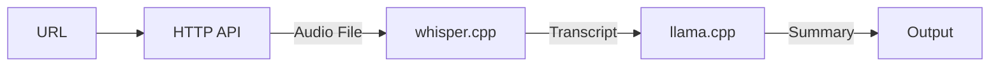

# TL;DWOL - Too Long; Didn't Watch or Listen 🎧💡

Web API that summarizes multimedia from various sources using modern AI tools.



## Supported inputs

- YouTube
- Apple Podcasts
- Direct file URLs

## Prerequisites

- Python 3.11
- [Poetry](https://python-poetry.org/)
- [FFmpeg](https://ffmpeg.org/)
- [whisper.cpp](https://github.com/ggerganov/whisper.cpp)
- [llama.cpp](https://github.com/ggerganov/llama.cpp)
- [llama.cpp compatible model](https://huggingface.co/NousResearch/Nous-Hermes-Llama2-13b)

## Quick Start 🚀

1. **Clone the Repository**:

   ```bash
   git clone https://github.com/oscargullberg/tldwol/blob/main/README.md
   cd tldwol
   ```

2. **Install Dependencies**:

   ```bash
   poetry install
   ```

## Configuration ⚙

Create a `.env` file in the project root and add your environment variables:

```env
LLAMA_CPP_DIR_PATH=path/to/llama.cpp
WHISPER_CPP_DIR_PATH=path/to/whisper.cpp
FILES_DL_DIR_PATH=path/to/download/directory
LLAMA_MODEL_PATH=path/to/model
WHISPER_MODEL_PATH=/some/path/bin/whisper.cpp/models/ggml-large.bin
```

## Usage 🎮

1. **Start the Server**:

   ```bash
   poetry run start
   ```

2. **Request a Summary**:

   ```bash
   curl "http://127.0.0.1:8000/?url=https://youtube.com/watch?v=thOifuHs6eY"
   ```

   ```json
   {
     "summary": "The provided content highlights the significance of hexagons in nature and human-made objects. It emphasizes the strength and stability of hexagons and ..."
   }
   ```
